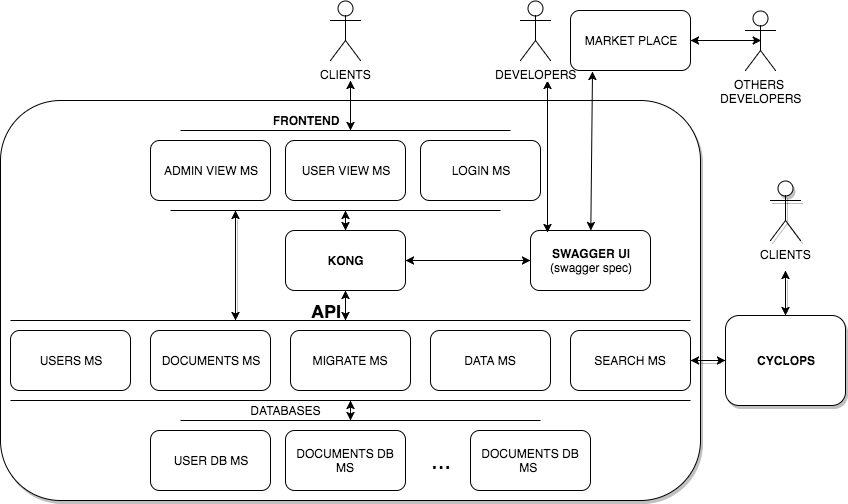

# Cloud-native ARKIS Prototype

The ARKIS microservices prototype is a [cloud-native document management system](https://blog.zhaw.ch/icclab/cloud-native-document-management/) created using a cloud-native architecture within the Service Prototyping Lab at Zurich University of Applied Sciences. The design criteria the software adheres to are elastic scalability and resilience achieved through managed composite microservices and isolation flexibility achieved through runtime-configurable multi-tenancy models. The implementation consists of Docker containers running atop Kubernetes. (Our blog posts also inform about how to achieve similar setups with docker-compose and Vamp.)

## Microservice architecture

  - Each microservice is instantiated using a docker container image; 8 in total plus one for the database (external image).
  - You can see the code inside the folder 'containers'.
  - All the images are in the public docker hub repository: [chumbo](https://hub.docker.com/u/chumbo/)
  

 
### Frontend microservices

#### Login

- port_login: 32000
- UI for the login web page.
- You can try to login or create a new user.
    
#### Users

- port_users: 32001
- UI for the users web page.
- You can manage all the documents of these user.(create, delete, search, ...)
    
#### Admin

- port_login: 32002
- Admin UI web page.
- You can see users, delete users, add new generic documents, migrate between the different multi-tenant options.

### Backend microservices

Note: All backends are implemented with Python using the Bottle web service framework.

#### Documents

- port_documents: 31999
- CRUD of documents

#### Search

- port_search: 30004
- Full text search in the documents of one user.

#### Migrate

- port_migrate: 30003
- Move the documents of one user to a different multi-tenant option.

#### Data

- port_data: 30002
- For add generic documents to one user.

#### Users

- port_users: 30001
- CRUD users.

### Database micro-services

- Persistent deployment for documents and users.
- The container image is the official mongo image.
- The database for users is running in the port 30009.
 
#### Documents

   Different multitenant option. All these options are working in these version.
 
   - A: Shared DBMS, Shared database, shared schema, shared table/collection
    - port: 30005
   - B: Shared DBMS, Shared database, shared schema, one table/collection per tenant
    - port: 30006
   - C: Shared DBMS, Shared database, one schema per tenant. (Not make sense with mongo) 
    - port: 30007
   - D: Shared DBMS, one database per tenant
    - port: 30008
   - E: One DBMS per tenant
    - port: 30010 + tenant_id
    
## API REST

Useful endpoints for the API REST:

### Users

  - GET: host:port_user/users/(id)
  - GET: host:port_user/users/
  - POST: host:port_user/users
  - PUT: host:port_user/users 
  - DELETE: host:port_user/users/(id)
  - GET: host:port_user/validate/(user)/(password)

### Documents

  - GET: host:port_documents/documents/(user)/(option)/last
  - GET: host:port_documents/documents/(user)/(option)/lim/(lim)
  - GET: host:port_documents/documents/(user)/(option)/(other_id)
  - POST: host:port_documents/documents/(user)/(option)
  - PUT: host:port_documents/documents/(user)/(option)/(other_id)
  - DELETE: host:port_documents/documents/(user)/(option)/(other_id)

  
### Search

  - GET: host:port_search/documents/search/(user)/(option)/(pattern)
    
### Data

  - GET: host:port_data/data/(user)/(option)/(limit)
  
### Migrate

  - GET: host:port_migrate/migrate/(user)/(option)

## [OPEN API specification](https://github.com/OAI/OpenAPI-Specification)

We have created an OpenAPI specification file of this API.
In this file we cover in detail the two main microservices: Documents and Users.
You can use the swagger.json file to see all the information easly using the friendly [swagger ui](https://swagger.io/swagger-ui/).

## [Kong](https://getkong.org/)

You can deploy the Kong files in this repository to have Kong in Kubernetes (no persistance). Or use the official one if your kubernetes cluster is in Google cloud.
Now for add each microservices to Kong you must use the names: documents, search, data, migrate and users. To use the API with Kong
you must use the Kong endpoint with the same path that are described before it and with the name of the microservices as a header parameter.
 Example: curl -X GET "http:// + endpoint Kong +/documents/2/A/last" -H  "accept: application/json" -H  "Host: documents"
 
## Tutorial

### Create

0. Clone this repository.
1. Install [kubectl](https://kubernetes.io/docs/user-guide/kubectl-overview/) 

#### Google persistance 
2. Create a [kubernetes cluster in google cloud](https://cloud.google.com/container-engine/).
3. Create the next [persistent disks](https://cloud.google.com/compute/docs/disks/add-persistent-disk#create_disk ) in the same zone that you have your cluster:
 - a: mongodb-disk-a
 - b: mongodb-disk-b
 - c: mongodb-disk-c
 - d: mongodb-disk-d
 - e: mongodb-disk-(number of tenant) where number of tenant belong to {0,1, ... ,9}
 - users: disk-mongo-shared-users
4. Run the script: create.sh 
5. If you want create more tenants with the multitenant option E:
    - Create the persistent: disk mongodb-disk-(number of tenant)
    - Create the microservice:
        - cd KubernetesBlueprints/DatabaseMicroServices/googlecloudpersistance/OPTIONE
        - change the nodePort to 30010 + number of tenant
        - run: kubectl create -f .
        
#### No persistance 
2. Run the script: create-nopersistance-a.sh

### Use
Until here, you have running ARKIS 3.0.
Now, you can add users and documents using the Admin UI or the API REST.
The first user that you create will be the admin. The rest are users of the app.
From the Admin view you can add documents to the users.
From the User view you can manage your documents.

### Delete
#### No persistance
 1. 
    - If you want keep your cluster: Run the script: delete-nopersistance-a.sh
    - If you don't want keep your cluster: Just delete your cluster 

#### Google persistance  
1. 
    - If you want keep your cluster: Run the script: delete.sh
    - If you don't want keep your cluster: Just delete your cluster 
2. Delete all the persistent disk.

## Next steps

1. Create automatically the persistent disk for the multi-tenancy option: E.
2. Create blueprints for docker-swarm.
